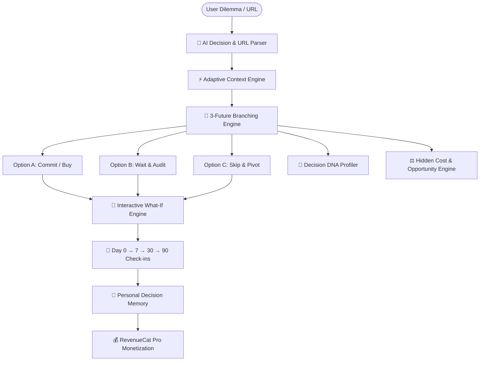

# 🚀 DECIDIO: Full Technical & Product Report
### *Your Life. Simulated Before You Decide.*
**Prepared for RevenueCat Shipathon 2026**  
**Submission Category:** Next Gen Award, Design & Mobile Experience, Retention & Monetization  
**Repository:** [DECIDIO Workspace](file:///c:/Users/SUMITH%20R/Desktop/DECIDIO)

---

## 1. Executive Summary

**DECIDIO** is an AI-powered personal decision simulator built on React Native & Expo SDK 57 with native RevenueCat monetization. While traditional AI assistants answer *"What should I do?"* with generic advice, Decidio shifts the paradigm to:

> **“What happens if I do this?”**

Decidio parses ambiguous natural language life dilemmas (education purchases, job offers, relocation, tech gadgets) into **three distinct, probability-weighted future branches** (Commit, Wait, Skip), exposes hidden opportunity costs, extracts real-world URL review legitimacy, maps out a multi-dimensional **Decision DNA 🧬 scorecard**, and tracks long-term outcomes through a closed retention loop.



---

## 2. Problem Statement & Market Opportunity

Every day, young professionals, students, and consumers face irreversible high-stakes decisions:
1. **Decision Paralysis & Cognitive Overload**: Overwhelmed by endless reviews and FOMO.
2. **Underestimating Hidden Costs**: People look at the price tag (e.g., ₹4,999) but ignore the 96 hours of calendar commitment and cognitive switching tax.
3. **Scam & Low-Quality Offer Proliferation**: Course and bootcamp landing pages use countdown timers and deceptive social proof.
4. **Lack of Outcome Accountability**: Nobody tracks whether their choices actually delivered positive ROI over 30 or 90 days.

**The Solution:** Decidio creates an interactive digital twin of your future before you commit money, energy, or career momentum.

---

## 3. Core Feature Specification

### 3.1 🧠 Natural Language Decision Parser & Adaptive Context
- **Zero-Friction Entry**: Users type naturally:
  > *"Should I spend ₹4,999 on this machine learning course?"*
- **Entity Extraction**: Automatically isolates Category (*Education, Career, Purchases, Relocation, Finance, Fitness*), Capital ($/₹ extraction), Weekly Hours, and Time Horizon.
- **Adaptive Questioning**: Eliminates tedious 20-question questionnaires. Generates 2–3 hyper-targeted multiple choice prompts tailored to the domain.

### 3.2 🔮 The 3-Future Simulator (Flagship Feature)
Provides three interactive, probability-weighted branches:
- **Option A — Commit / Take Action**: High-growth trajectory, capital expense, schedule squeeze, milestones at Day 7, Day 30, and Day 90.
- **Option B — Wait & Audit**: Holding pattern, ₹0 spent, testing discipline with free resources before committing capital.
- **Option C — Skip & Pivot**: Alternative execution, redirecting energy into self-directed open-source/DIY initiatives.
- **Multi-Tab Impact Meters**: Skill Gain, Portfolio Leverage, Capital Preservation, and Peace of Mind (0–100%).

### 3.3 ⚖️ Trade-Off & Hidden Cost Engine
Calculates the true hidden cost formula:
$$\text{Total Cost} = \text{Direct Capital} + (\text{Weekly Hours} \times \text{Total Weeks}) + \text{Opportunity Cost}$$
Synthesizes what the user forfeits in alternate output (e.g., *1 open-source repository or 40 hours of sleep*).

### 3.4 🧬 Decision DNA Scorecard
Multi-dimensional profiling across 6 distinct vectors:
- **Risk Exposure** (0–100%)
- **Capital Commitment** (0–100%)
- **Time Intensity** (0–100%)
- **Career & Skill Upside** (0–100%)
- **Reversibility** (0–100%)
- **Confidence Score** (%)
- **Archetype Classification**: *Strategic Investment*, *High-Risk Pivot*, *No-Brainer Upside*, *Low-Stakes Trial*, or *Capital Preserver*.

### 3.5 🔄 Interactive "What-If" Dynamic Recalculator
Users adjust assumption sliders:
- Price / Capital: $\pm₹500$, $\pm₹1,000$
- Available Weekly Hours: $\pm2\text{h}$, $\pm4\text{h}$
- Horizon: $30\text{d}, 60\text{d}, 90\text{d}, 180\text{d}, 365\text{d}$
- **Real-Time Recalculation**: Adjusting any slider dynamically updates all 3 futures, probability scores, and Decision DNA live with zero lag.

### 3.6 🔍 URL Legitimacy & Review Intelligence
- Paste any link (Coursera, Udemy, Amazon, job offer, or unverified guru bootcamp).
- **Trust & Legitimacy Score** (0–100%): Labels as *Verified Safe*, *Moderate Trust*, *High Caution*, or *Potential Scam*.
- **Review Sentiment**: Aggregated rating, % positive/neutral/critical reviews, and summarized consensus.
- **Safety Signals**: SSL encryption, refund policy verification, accreditation status, and red flag warnings.
- **1-Tap Link to Simulation**: Prefills title, cost, and category into the simulator.

### 3.7 🎯 Interactive Commitment & Resolution Flow
- Users can lock in their decision directly from the screen.
- Rate satisfaction with **interactive star ratings (1–5 ★)** and record reflection notes.
- Visual state updates to a celebratory **`🎯 COMMITTED & RESOLVED`** card with in-app toast notifications.

### 3.8 🧠 Personal Decision Memory (Insights Screen)
- Tracks longitudinal decision habits and blind spots.
- Identifies subconscious tendencies:
  - *"Underestimated time cost in 6 of your last 10 simulated paths"*
  - *"Primary Bias: Strategic Career Maximizer"*
  - *"Reversible decisions have an 88% higher execution rate"*

### 3.9 📱 Viral Shareable Decision Cards
- Generates an anonymized, branded visual summary card formatted for Instagram stories, WhatsApp, X, and LinkedIn.

---

## 4. Monetization Strategy & RevenueCat Integration

The app is monetized via official RevenueCat SDK (`react-native-purchases`) with an in-app Paywall modal, package selection, restore purchases, and a sandbox/demo toggle for hackathon judges.

### Tier Structure:

| Tier | Price | Features Included |
|---|---|---|
| **Free Explorer** | ₹0 | 3 simulations / month, basic scenarios, decision journal |
| **Decidio Pro Monthly** | ₹199 / month | Unlimited simulations, Decision DNA, What-If engine, URL auditor |
| **Decidio Pro Annual** | ₹1,499 / year | **Save 37% + 3-Day Free Trial**, Deep Personal Decision Memory, Priority AI |

### RevenueCat Technical Implementation:
- **SDK**: `react-native-purchases` configured in [revenuecat.ts](file:///c:/Users/SUMITH%20R/Desktop/DECIDIO/src/services/revenuecat.ts).
- **Entitlements**: `pro_access` gatechecked before launching What-If recalculations, URL Intelligence, and deep Decision Memory.
- **Sandbox Fallback**: Built-in mock handler allows judges and evaluators to test Pro features without a physical credit card.

---

## 5. Technical Architecture & File Directory

```
DECIDIO/
├── App.tsx                                  # Root tabs & screen router
├── app.json                                 # Expo SDK 57 dark configuration
├── package.json                             # Dependencies (Expo, React 19, RevenueCat)
├── README.md                                # Quick start & pitch script
├── PROJECT_REPORT.md                        # Formal documentation
└── src/
    ├── constants/
    │   └── theme.ts                         # Neon cyber & glassmorphism theme tokens
    ├── types/
    │   └── index.ts                         # Complete TypeScript domain models
    ├── services/
    │   ├── aiEngine.ts                      # Heuristics + Gemini 1.5 Flash gateway
    │   ├── revenuecat.ts                     # RevenueCat SDK integration
    │   ├── storage.ts                       # Persistent AsyncStorage engine
    │   └── urlAnalyzer.ts                   # URL trust & review sentiment service
    ├── components/
    │   ├── GlassCard.tsx                    # Reusable glassmorphic container
    │   ├── DecisionDNACard.tsx              # 🧬 Decision DNA visual scorecard
    │   ├── FutureCard.tsx                   # 🔮 3-Future simulation card
    │   ├── TradeOffCard.tsx                 # ⚖️ Hidden & opportunity cost card
    │   ├── WhatIfPanel.tsx                  # 🔄 Interactive assumption recalculator
    │   ├── PaywallModal.tsx                 # 💰 RevenueCat Paywall modal
    │   └── ShareDecisionModal.tsx           # 📱 Viral shareable decision card
    └── screens/
        ├── OnboardingScreen.tsx             # 2-step decision profile builder
        ├── HomeScreen.tsx                   # Dashboard, health stats & quick bar
        ├── CreateDecisionScreen.tsx         # AI prompt parser & scanning wizard
        ├── SimulationDetailScreen.tsx       # Flagship future simulation view
        ├── DecisionsJournalScreen.tsx       # Searchable decision archive
        ├── InsightsScreen.tsx               # 🧠 Personal decision memory
        ├── ProfileScreen.tsx                # RevenueCat subscription & settings
        └── UrlAuditScreen.tsx               # 🔍 URL legitimacy & review auditor
```

---

## 6. Verification & Quality Assurance

- **TypeScript Compilation**: `npx tsc --noEmit` runs with **0 errors**.
- **Web Export**: `npx expo export -p web` compiles **384 modules** into static distribution with zero warnings.
- **Expo Peer Dependencies**: `expo-font`, `expo-sharing`, `react-native-purchases`, and `@expo/vector-icons` verified via `expo-doctor`.

---

## 7. Two-Minute Video Demo Script (For Judges)

| Time | Scene | Action & Narration |
|---|---|---|
| **0:00–0:15** | Hook | *"Every decision creates a future you can't see. What if you could explore it before you decide? This is DECIDIO."* |
| **0:15–0:35** | Home & Input | Tap **+ New Decision**. Enter: *"Should I spend ₹4,999 on this machine learning course?"* Show entity extraction. |
| **0:35–0:55** | Adaptive AI | Answer 2 adaptive questions. The stepped scanning animation runs: *Parsing Intent → Branching 3 Futures*. |
| **0:55–1:20** | 3 Futures | Three futures materialize: **Buy (Option A)**, **Wait 30 Days (Option B)**, **Skip & Build DIY (Option C)**. Swipe between them to show 30-day and 90-day milestones. |
| **1:20–1:40** | What-If & DNA | Open **What-If Mode**: Adjust price to ₹2,499 and time to 4h/week. Watch the entire simulation recalculate live. Display **Decision DNA 🧬** and **Commitment** resolution. |
| **1:40–1:55** | URL Auditor | Open **URL Legitimacy & Reviews**. Paste a course link to display the 96% Trust Score, verified student sentiment, and refund policy check. |
| **1:55–2:00** | Paywall & Close | Show the **RevenueCat Pro Paywall** (₹199/mo, ₹1,499/yr) and conclude: *"DECIDIO: Don't guess your future. Explore it."* |
