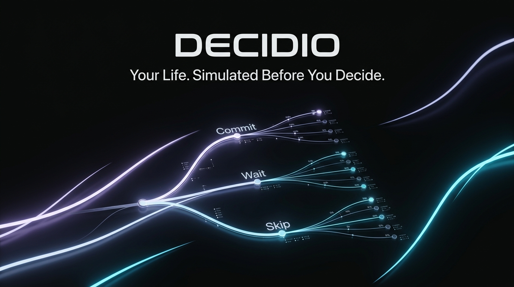
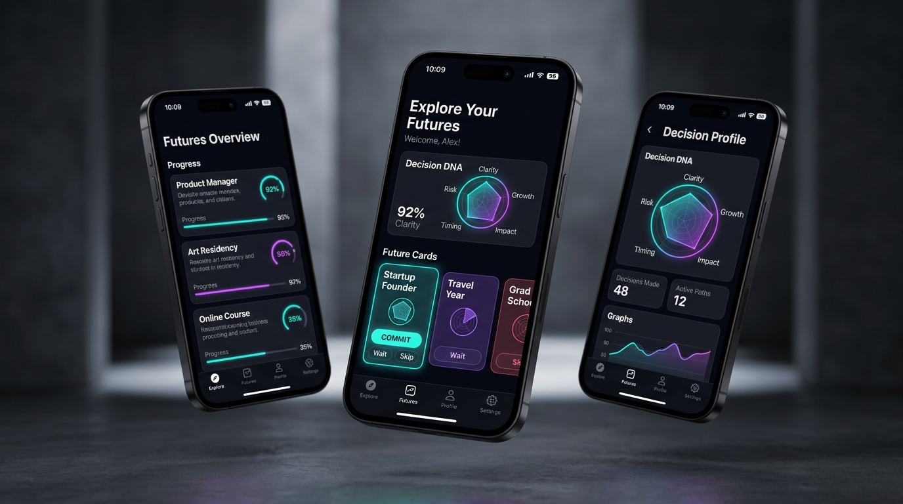
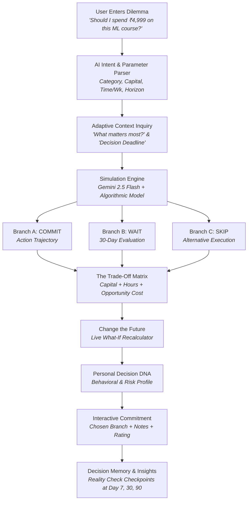
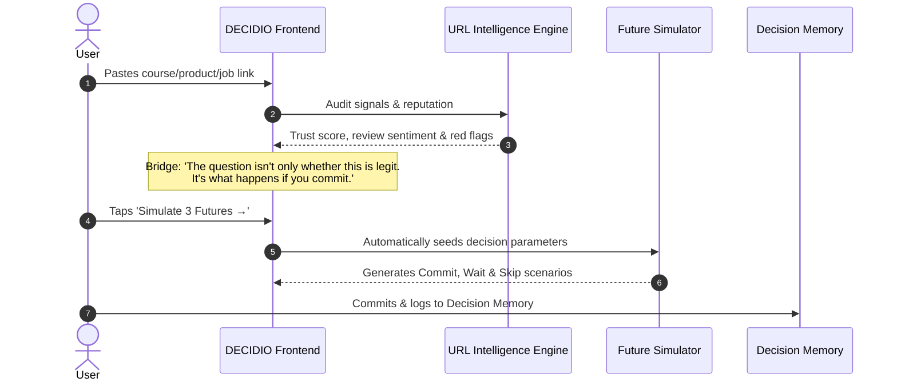

<div align="center">



# DECIDIO
### *Your Life. Simulated Before You Decide.*

[](https://opensource.org/licenses/MIT)
[](https://expo.dev)
[](https://reactnative.dev)
[](https://www.typescriptlang.org)
[](https://www.revenuecat.com)
[](https://ai.google.dev)

<p align="center">
  <b>An AI-powered personal decision simulator that helps you explore consequences, hidden costs, trade-offs, and probability-weighted futures before committing your capital, time, or momentum.</b>
</p>

[Explore Concept](#-core-concept) • [User Flow](#-decision-simulation-flow) • [Features](#-flagship-features) • [Architecture](#-system-architecture) • [Monetization](#-revenuecat-monetization) • [Quickstart](#-getting-started)

</div>

---

<div align="center">

</div>

---

## 🔮 Core Concept

Instead of asking:
> **"What should I do?"** *(passive chatbot advice)*

DECIDIO asks:
> **"What happens if I do this?"** *(active causal simulation)*

Life's high-stakes decisions—accepting a bootcamp, relocating to Bangalore, purchasing hardware, or leaving a job—aren't 50/50 guesses. Every path carries unseen friction, financial bleed, calendar compression, and irreversible opportunity costs.

**DECIDIO is not a chatbot, a journal, or a generic productivity dashboard.** It is a **Decision Operating System** designed to unpack complex dilemmas into three distinct, probabilistically-grounded future branches before you pull the trigger.

---

## 🔄 Decision Simulation Flow



---

## 🔗 URL Auditor to Simulation Pipeline



---

## ⚡ Flagship Features

### 1. 🧠 Natural Language Decision Parser
* Parses messy, human thoughts into structured parameters:
  * **Intent & Title**: Automatic stripping of conversational filler.
  * **Category**: Education, Career, Purchases, Relocation, Finance, Fitness.
  * **Capital**: Currency detection (`₹`, `$`) and smart magnitude estimation.
  * **Time Commitment**: Hours per week allocated.
  * **Evaluation Horizon**: 30, 90, or 365 days.

### 2. 🎯 Adaptive Context Inquiries
* Zero multi-page forms. Progressive disclosure asks only what sharpens the simulation:
  1. *What matters most here?* (`Money`, `Time`, `Career`, `Learning`, `Freedom`, `Stability`)
  2. *How soon do you need to decide?* (`Today`, `This week`, `This month`, `No deadline`)

### 3. 🔮 3 Distinct Probability Futures
* **Branch A — COMMIT**: Immediate execution trajectory, upfront capital outlay, milestone projections at Day 7, 30, and 90.
* **Branch B — WAIT**: Delaying commitment for 30 days, ₹0 spent, testing discipline with free curriculum/resources.
* **Branch C — SKIP**: Walking away, preserving capital, and redirecting focused hours toward internal assets or open-source projects.

### 4. ⚖️ The Trade-Off & Hidden Cost Engine
* Exposes the true cost of an action beyond the sticker price:
  $$\text{True Cost} = \text{Capital Outlay} + (\text{Weekly Hours} \times \text{Weeks}) + \text{Opportunity Cost}$$
* Restrained multi-dimensional indicators across Money, Time, Career, Learning, Risk, Flexibility, and Momentum.

### 5. 🔄 "Change the Future" — Live What-If Recalculator
* Instant dynamic sliders for:
  * Budget / Capital Available ($\pm ₹1,000$)
  * Weekly Hours Committed ($\pm 2\text{ hrs}$)
  * Decision Horizon ($30\text{d}, 60\text{d}, 90\text{d}, 180\text{d}, 365\text{d}$)
* Side-by-side **Before vs. After** delta breakdown updating scores in real-time.

### 6. 🧬 Decision DNA Profile
* 6-factor behavioral scoring based on real decisions:
  * Risk Preference
  * Time Preference
  * Money Sensitivity
  * Certainty Preference
  * Exploration Bias
  * Outcome Reversibility

### 7. 🔗 URL Link Auditor
* Pre-purchase verification for online bootcamps, hardware, courses, and SaaS subscriptions:
  * Domain legitimacy & trust score
  * Verified review sentiment aggregation
  * Warning flags & dark-pattern alerts
  * **1-Tap Bridge**: Seamlessly pushes verified URL context into the 3-futures simulation engine.

### 8. 🎯 Commitment & Reality Check Loop
* Commit to a branch with personal reflections and confidence ratings (1–5 stars).
* Automatically tracks long-term checkpoints: Day 7 friction check, Day 30 trajectory check, and Day 90 outcome reality check.

### 9. 📊 Personal Decision Memory & Insights
* Discovers subconscious patterns:
  * *"You tend to underestimate time intensity in 6 of your last 10 simulated paths."*
  * *"Primary Bias: Strategic Career Maximizer."*

---

## 🏛 System Architecture

```mermaid
graph LR
    subgraph Client [Cross-Platform Client]
        UI[Expo / React Native UI<br/>Obsidian Editorial Theme]
        Nav[Tab & Stack Navigation<br/>Home | Decisions | Insights | Profile]
        State[Local App State & Hooks]
    end

    subgraph Logic [Intelligence Layer]
        Parser[NL Decision Parser]
        AI[Dual AI Engine]
        WhatIf[What-If Recalculator]
        DNA[Decision DNA Synthesizer]
    end

    subgraph External [External Services]
        Gemini[Google Gemini 2.5 Flash]
        RC[RevenueCat Purchases SDK<br/>iOS / Android / Web Sandbox]
        Storage[(AsyncStorage Persistence)]
    end

    UI --> Nav
    Nav --> State
    State --> Parser
    Parser --> AI
    AI --> Gemini
    AI --> WhatIf
    WhatIf --> DNA
    State --> Storage
    UI --> RC
```

---

## 💰 RevenueCat Monetization

DECIDIO implements an ethical, value-centric subscription architecture via RevenueCat:

| Tier | Price | Simulations | What-If Engine | Decision DNA | URL Auditor | Decision Memory |
| :--- | :---: | :---: | :---: | :---: | :---: | :---: |
| **Explorer** *(Free)* | **₹0** | 3 / month | Basic | — | 1 URL check | 3 entries |
| **Pro Monthly** | **₹199** / mo | **Unlimited** | Live dynamic | Full 6-factor | Unlimited | Unlimited |
| **Pro Annual** | **₹1,499** / yr | **Unlimited** | Live dynamic | Full 6-factor | Unlimited | Deep retrospective |

> **Shipathon 2026 Judge Demo Override**: Includes a 1-tap Pro entitlement switch inside Settings / Profile to evaluate full Pro capabilities in any environment without entering credit cards.

---

## 📁 Repository Structure

```
DECIDIO/
├── assets/
│   └── images/
│       ├── decidio_hero_banner.jpg      # Product hero visual
│       └── decidio_app_mockup.jpg       # Multi-screen mobile showcase
├── src/
│   ├── components/
│   │   ├── DecisionDNACard.tsx          # 6-factor behavioral radar & breakdown
│   │   ├── FutureCard.tsx               # Branch cards (Commit, Wait, Skip)
│   │   ├── GlassCard.tsx                # Obsidian editorial surface container
│   │   ├── PaywallModal.tsx             # RevenueCat subscriptions & restore
│   │   ├── ShareDecisionModal.tsx       # Shareable decision cards
│   │   ├── TradeOffCard.tsx             # Opportunity cost & commitment formula
│   │   └── WhatIfPanel.tsx              # Live dynamic parameter recalculator
│   ├── constants/
│   │   └── theme.ts                     # Colors, typography, spacing tokens
│   ├── screens/
│   │   ├── CreateDecisionScreen.tsx     # Natural language input & adaptive Qs
│   │   ├── DecisionsJournalScreen.tsx   # Chronological archive & rating history
│   │   ├── HomeScreen.tsx               # Main decision intelligence launchpad
│   │   ├── InsightsScreen.tsx           # Behavioral patterns & memory
│   │   ├── OnboardingScreen.tsx         # Arenas & weights fine-tuning
│   │   ├── ProfileScreen.tsx            # Settings, Gemini Key & Judge Switch
│   │   ├── SimulationDetailScreen.tsx   # The Flagship 3-Futures Simulator
│   │   └── UrlAuditScreen.tsx           # Link legitimacy & simulation bridge
│   ├── services/
│   │   ├── aiEngine.ts                  # Hybrid Gemini 2.5 + Deterministic engine
│   │   ├── revenuecat.ts                # RevenueCat SDK & sandbox bridge
│   │   └── storage.ts                   # Local AsyncStorage persistence
│   └── types/
│       └── index.ts                     # TypeScript data contracts & schemas
├── App.tsx                              # App root & navigation container
├── app.json                             # Expo application configuration
├── creative-studio-reference.html       # Visual design reference implementation
├── LICENSE                              # MIT License
├── package.json                         # Dependencies & project scripts
└── tsconfig.json                        # TypeScript strict configuration
```

---

## 🚀 Getting Started

### Prerequisites
* Node.js 18+
* npm, yarn, or bun
* Expo Go app on mobile (iOS / Android) or modern web browser

### Installation
```bash
# 1. Clone repository
git clone https://github.com/rshamith777-cpu/DECIDIO.git
cd DECIDIO

# 2. Install dependencies
npm install

# 3. Start development server
npx expo start --web
```

### Running on Mobile
```bash
# Start Metro and scan QR code with Expo Go:
npx expo start

# Run directly on iOS simulator (Mac required):
npx expo run:ios

# Run directly on Android emulator / device:
npx expo run:android
```

### Type Checking & Web Export Validation
```bash
# Verify TypeScript strict typing:
npx tsc --noEmit

# Test production web bundle:
npx expo export -p web
```

---

## 🏆 RevenueCat Shipathon 2026 Focus

* **Next Gen Award**: Designed specifically for high-stakes early-career dilemmas (first jobs, internships, coding bootcamps, relocations, tech hardware).
* **Retention Mechanics**: Built-in 7-day, 30-day, and 90-day decision retrospective loops that bring users back to log outcomes.
* **Monetization Fit**: Seamlessly bridges casual exploratory decisions to deep What-If sensitivity analysis and Decision DNA for paying subscribers.

---

## 📄 License

This project is open-source and licensed under the [MIT License](LICENSE).

Copyright (c) 2026 **Shamith (DECIDIO)**.
